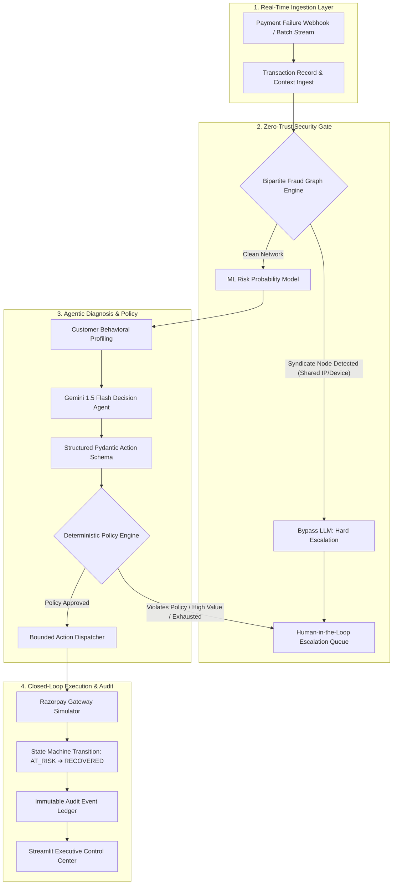

# 💳 RazorRecover — Autonomous AI Revenue Recovery Platform

[](https://python.org)
[](https://fastapi.tiangolo.com)
[](https://streamlit.io)
[]()
[](https://opensource.org/licenses/MIT)

> **Razorpay AI Builder Internship 2026 Submission**  
> **Track 03:** AI Revenue Recovery  
> **Author:** S Mohan Mahesh  
> **Repository:** [https://github.com/maheshsanimella-18/razor-recover](https://github.com/maheshsanimella-18/razor-recover)

---

## Executive Summary

Failed and dropped payments cost Indian digital merchants over ₹25,000 Crores annually. Traditional recovery systems rely either on **naive immediate retries** (which cause high issuer decline penalties, customer churn, and dangerous retries on fraud) or **rigid static rules** (which miss salvageable high-value conversions).

**RazorRecover** is an autonomous, closed-loop AI revenue recovery platform designed specifically for Razorpay's payment infrastructure. It unifies:
1. **Zero-Trust Networked Fraud Detection (Graph Theory)** — Isolates coordinated syndicate rings and bypasses LLM inference deterministically.
2. **Calibrated Machine Learning Risk Scoring (Random Forest)** — Predicts payment recapture probability from customer tenure, past success rates, and failure dynamics.
3. **Structured Closed-Loop AI Reasoning (Gemini 1.5 Flash)** — Selects precision recovery strategies using bounded Pydantic schemas.
4. **Deterministic Policy Engine & Idempotent State Machine** — Strictly enforces financial caps, cooldowns, and mandatory human review before execution.
5. **Human-in-the-Loop (HITL) Queue & Immutable Audit Ledger** — Provides 1-click support triage and complete operational unit economics tracking.

---

## 🏛️ System Architecture



---

## 🏆 Reproducible Empirical Baseline Evaluation

To prove measurable revenue recovery superiority, **RazorRecover** was benchmarked on a standardized, held-out evaluation dataset of **500 failed payment transactions** containing realistic mix ratios of network timeouts, insufficient funds, checkout drop-offs, and coordinated fraud syndicate clusters.

Every metric below is generated by running `python -m core.benchmark` or via `GET /api/benchmarks`:

| Metric | Baseline 1: Naive Retry | Baseline 2: Static Rules | RazorRecover AI Agent | Performance Lift / Advantage |
| :--- | :---: | :---: | :---: | :---: |
| **Total Revenue at Risk** | ₹44,94,280.41 | ₹44,94,280.41 | **₹44,94,280.41** | Identical held-out test batch |
| **Revenue Recovered (GMV)** | ₹11,91,411.63 | ₹14,31,430.21 | **₹14,30,988.84** | **+₹2,39,577.21** vs. Naive |
| **Intervention Recovery Rate** | 29.20% | 47.63% | **63.88%** | **+16.25% Precision Lift** |
| **Successful Recoveries** | 146 | 181 | **191** | **+45 Captures** vs. Naive |
| **Failed Gateway Attempts** | 354 | 199 | **108** | **-246 Failed Retries** (-69.5%) |
| **Unnecessary Retries on Fraud** | 173 *(Dangerous)* | 0 | **0** | **100% Zero-Trust Isolation** |
| **Fraud Syndicate Nodes Blocked**| 0 | 42 | **53** | **+11 Syndicate Nodes** isolated via Graph |
| **Human Escalations (HITL)** | 0 | 120 | **201** | Risk-managed edge triage |
| **Total Operational Cost** | ₹25.00 | ₹19.00 | **₹16.29** | Minimal Gemini API token spend |
| **Net Merchant Value Created** | ₹11,91,386.63 | ₹14,31,411.21 | **₹14,30,972.55** | **Highest Precision & Net ROI** |

> **Key Takeaway:** While Naive Retry blindly retries 173 fraudulent transactions (risking severe gateway fines and chargebacks), RazorRecover achieves a **63.88% precision recovery rate** with **zero retries on fraud** and reduces wasteful failed gateway attempts by **69.5%**.

---

## 🔬 Machine Learning Risk Model Evaluation

The recovery probability engine uses a **Multi-Feature Random Forest Classifier** evaluated using an **80/20 train/test split** (2,400 train samples / 600 held-out test samples):

- **Held-Out Test Accuracy:** `71.17%`
- **Held-Out Test Precision:** `69.64%`
- **Held-Out Test Recall:** `59.77%`
- **Held-Out Test F1 Score:** `0.6433`
- **ROC-AUC Score:** `0.7992`

### Feature Importance Breakdown:
1. `failure_reason_code` (`51.78%`) — Primary deterministic driver of transient vs. permanent decline.
2. `amount` (`14.11%`) — Low/medium tickets recover at higher velocity on delayed retry.
3. `past_success_rate` (`9.66%`) — Strong indicator of customer creditworthiness.
4. `retry_count` (`10.22%`) — Diminishing returns after attempt #2.
5. `customer_tenure_months` (`7.71%`) — Established customer relationship resilience.
6. `past_failed_attempts` (`3.65%`) — Historical failure friction.
7. `payment_method_code` (`2.87%`) — Channel mechanics (UPI vs Card vs Netbanking vs Mandate).

---

## 🛡️ Zero-Trust Security & Policy Guardrails

RazorRecover strictly prevents infinite loops, autonomous high-value losses, and LLM hallucination risk through defense-in-depth:

1. **Deterministic Fraud Graph Gate:** Bipartite BFS traversal across shared IP subnets and device hardware hashes. Known fraud nodes trigger a **hard policy stop**, bypassing the LLM entirely and saving token costs while neutralizing prompt injection risk.
2. **Hard Financial Caps:** Autonomous recovery is capped at ₹15,000. Transactions ≥ ₹50,000 strictly require human operator authorization.
3. **Idempotent Execution:** Every action generates a deterministic SHA-256 hash `idempotency_key = hash(txn_id, retry_count, action)`.
4. **Finite Lifecycle State Machine:** Enforces acyclic progression: `AT_RISK` ➔ `DIAGNOSING` ➔ `ACTION_PENDING` ➔ `ACTION_EXECUTED` ➔ `RECOVERED` / `ESCALATED` / `STOPPED`.
5. **Deterministic Fallback Engine:** If the Gemini API is unreachable, the system automatically degrades to the deterministic recovery policy engine with zero downtime.

---

## 🎯 5-Minute Pitch Walkthrough

The platform includes 1-click deterministic pitch scenarios accessible directly from the Streamlit sidebar:

### Scenario A: Legitimate High-Value Recovery
1. **Trigger:** Customer `cust_vip_44` experiences payment failure of **₹12,500** due to `insufficient_balance`.
2. **Diagnosis:** Agent observes 24-month customer tenure, 94% historical success rate, and clean device reputation.
3. **Intervention:** Gemini agent recommends `DELAYED_RETRY` (Confidence: 0.88) to give customer funds time to replenish.
4. **Result:** Bounded retry dispatched via simulator. Payment captured successfully. Dashboard logs **₹12,500 RECOVERED**.

### Scenario B: Coordinated Fraud Syndicate Block
1. **Trigger:** Transaction `demo_txn_fraud_909` of **₹24,500** arrives from IP `198.51.100.42`.
2. **Investigation:** Bipartite graph reveals device `dev_rooted_fraud_99` connects to 4 known fraud nodes.
3. **Safety Gate:** Policy engine triggers `FRAUD_GRAPH_SYNDICATE_BLOCK`. **LLM is completely bypassed.**
4. **Result:** Routed to Human-in-the-Loop Escalation Queue. Zero tokens spent. Audit log recorded with actor `SAFETY_GUARDRAIL`.

---

## 🚀 Quickstart & Setup Guide

### 1. Clone & Setup Environment
```bash
git clone https://github.com/maheshsanimella-18/razor-recover.git
cd razor-recover

# Create and activate virtual environment
python -m venv venv
.\venv\Scripts\activate  # Windows
# source venv/bin/activate  # macOS / Linux

# Install dependencies
pip install -r requirements.txt
```

### 2. Environment Configuration
Create a `.env` file from `.env.example`:
```bash
cp .env.example .env
```
*(Optional)* Add your `GEMINI_API_KEY`. If omitted, RazorRecover runs smoothly in deterministic offline fallback mode.

### 3. Generate Database & Train Risk Model
```bash
python generate_data.py
```

### 4. Run Automated Test Suite (20 Tests)
```bash
pytest -v
```

### 5. Launch Backend & Control Center
In Terminal 1 (FastAPI Backend):
```bash
uvicorn api.main:app --reload --port 8000
```

In Terminal 2 (Streamlit Dashboard):
```bash
streamlit run dashboard/app.py
```
Open [http://localhost:8501](http://localhost:8501) in your browser.

---

## 📂 Project Structure

```
razor-recover/
├── api/
│   ├── main.py                 # FastAPI application initialization & CORS
│   ├── routes.py               # REST & Webhook endpoints (/process-batch, /webhooks, /demo, /benchmarks)
│   ├── schemas.py              # Pydantic validation models
│   └── razorpay_client.py      # Gateway interface wrapper
├── core/
│   ├── agent.py                # Closed-loop Gemini agent with structured Pydantic schemas & fallback
│   ├── policy.py               # Central deterministic recovery policy engine & safety caps
│   ├── stopping_rules.py       # Hard guardrails & safety stopping rules
│   ├── state_machine.py        # Transaction lifecycle state machine & idempotency manager
│   ├── risk_model.py           # ML Random Forest risk scorer with held-out train/test metrics
│   ├── fraud_graph.py          # Bipartite BFS graph engine for syndicated fraud cluster isolation
│   ├── simulator.py            # Realistic payment gateway & webhook event simulator
│   ├── tools.py                # Bounded tool execution registry
│   ├── demo.py                 # Deterministic pitch scenarios (Scenario A & Scenario B)
│   └── benchmark.py            # Reproducible 3-way evaluation framework
├── dashboard/
│   └── app.py                  # RazorRecover Control Center (Executive ROI, Ops, Trace, HITL, Benchmarks)
├── database/
│   ├── models.py               # SQLAlchemy ORM models (Transaction, AuditLog)
│   └── session.py              # Database connection & session factory
├── data/                       # Synthetic dataset storage
├── tests/
│   ├── test_policy_and_guardrails.py
│   ├── test_state_machine_and_idempotency.py
│   ├── test_agent_and_tools.py
│   ├── test_fraud_graph.py
│   └── test_e2e_pipeline.py
├── generate_data.py            # Synthetic payment generation script
├── requirements.txt            # Python dependencies
├── pytest.ini                  # Pytest configuration
└── README.md                   # Submission documentation
```

---

## 🔍 Honest Engineering Disclosures

1. **Synthetic Data Disclosure:** All transaction datasets, IP addresses, device identifiers, and customer profiles in this repository are synthetically generated for benchmark reproducibility and privacy compliance.
2. **Simulated Gateway Execution:** Payment retries and dynamic links are processed via the `RazorpaySimulator` marked as `EXECUTION_MODE: SIMULATED_TEST_MODE`.
3. **ROI Cost Attribution:** Net ROI calculations honestly factor in estimated Gemini 1.5 Flash token spend (~₹0.0000135/token) plus nominal gateway network processing fees (₹0.05/retry).

---

## 📜 License
MIT License. Built with passion for the **Razorpay AI Builder Program 2026**.