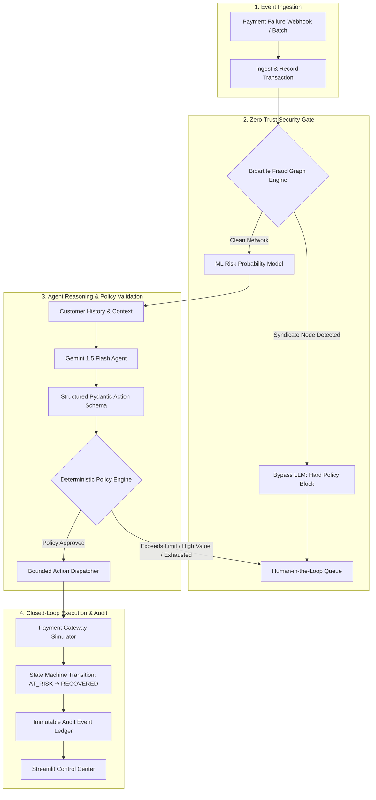

# RazorRecover — Autonomous AI Revenue Recovery Agent

[](https://python.org)
[](https://fastapi.tiangolo.com)
[](https://streamlit.io)
[]()
[](https://opensource.org/licenses/MIT)

> **Razorpay AI Builder Internship 2026 Submission**  
> **Track 03:** AI Revenue Recovery  
> **Author:** S Mohan Mahesh  
> **Repository:** [https://github.com/maheshsanimella-18/razor-recover](https://github.com/maheshsanimella-18/razor-recover)

---

RazorRecover is an autonomous, closed-loop revenue recovery prototype designed for digital payment gateways. When payments fail due to temporary network timeouts, balance deficits, or dropped checkouts, RazorRecover investigates customer context, scores recovery probability, detects networked fraud, and executes bounded recovery actions while strictly governed by deterministic financial guardrails and human review.

---

## 1. Problem

Payment failures represent a significant source of lost revenue for online merchants. Revenue leakage occurs primarily through:
- **Transient Gateway & Network Timeouts:** Temporary bank switch or issuer downtime where immediate or delayed re-attempt succeeds.
- **Temporary Insufficient Funds:** Customer balances that replenish within hours or days, where delayed retry avoids immediate card decline penalties.
- **Checkout & OTP Abandonment:** Customers dropping off before completing 3D Secure verification, salvageable via dynamic payment links.
- **Indiscriminate Retries & Fraud Vulnerability:** Naive retry strategies repeatedly hit failed or fraudulent cards, triggering gateway fines, merchant penalties, and increased chargeback risk.

---

## 2. Solution

RazorRecover replaces rigid retry schedules and unconstrained LLM calls with a **bounded, closed-loop recovery workflow**:

1. **Observe & Ingest:** Listens for payment failure events via webhooks or batch streams.
2. **Entity Network Investigation:** Bipartite graph analysis checks shared IP subnets and device fingerprints to isolate fraud syndicates.
3. **ML Probability Scoring:** Random Forest model estimates payment recapture likelihood based on customer tenure, failure type, and payment method.
4. **Structured AI Diagnosis:** Gemini 1.5 Flash agent diagnoses failure context and recommends an intervention using strict Pydantic schemas.
5. **Deterministic Policy Validation:** Central policy engine verifies financial caps, retry limits, and risk thresholds before any tool executes.
6. **Bounded Tool Execution:** Dispatches retry or recovery link via payment simulator.
7. **Observe Result & Audit:** Observes gateway outcome, advances the transaction state machine, and records an immutable audit log.

---

## 3. System Architecture



> **Key Architectural Principle:** The LLM proposes recovery decisions based on context. Deterministic policy rules govern whether actions are permitted.

---

## 4. Safety & Policy Guardrails

RazorRecover is designed with defense-in-depth to prevent autonomous high-value losses, infinite loops, and unvetted actions:

- **Deterministic Fraud Graph Gate:** Bipartite BFS traversal over shared entity infrastructure. Confirmed fraud links trigger a hard block, **bypassing the LLM completely** to prevent prompt manipulation and save token spend.
- **Autonomous Financial Caps:** Automated recovery is capped at ₹15,000. Transactions ≥ ₹50,000 strictly require human operator review.
- **Retry Limits:** Hard cap of 3 attempts per transaction with minimum cooldown periods.
- **Idempotent Execution:** Every recovery action produces a deterministic SHA-256 hash `idempotency_key = hash(txn_id, retry_count, action)` preventing duplicate charge attempts.
- **Finite Lifecycle State Machine:** Enforces unidirectional state progression: `AT_RISK` ➔ `DIAGNOSING` ➔ `ACTION_PENDING` ➔ `ACTION_EXECUTED` ➔ `RECOVERED` / `ESCALATED` / `STOPPED`.
- **Deterministic Offline Fallback:** If the external LLM API is unavailable, the system automatically degrades to the local rule-based policy engine with zero downtime.

---

## 5. Simulated Baseline Evaluation

To evaluate recovery performance, RazorRecover was benchmarked against two baseline strategies on a standardized held-out evaluation dataset of **500 synthetic payment failure transactions**.

All figures below are generated by running `python evaluate.py` or via `GET /api/benchmarks`:

| Metric | Baseline 1: Naive Retry | Baseline 2: Static Rules | RazorRecover AI Agent | Measured Advantage |
| :--- | :---: | :---: | :---: | :---: |
| **Simulated Revenue at Risk** | ₹44,94,280.41 | ₹44,94,280.41 | **₹44,94,280.41** | Identical test dataset |
| **Simulated Revenue Recovered**| ₹11,91,411.63 | ₹14,31,430.21 | **₹14,30,988.84** | **+₹2,39,577.21** vs. Naive |
| **Recovery Rate (%)** | 29.20% | 47.63% | **63.88%** | **+16.25% Precision Lift** |
| **Successful Recoveries** | 146 | 181 | **191** | **+45 Captures** vs. Naive |
| **Failed Gateway Retries** | 354 | 199 | **108** | **-246 Failed Retries** (-69.5%) |
| **Unnecessary Retries on Fraud**| 173 *(High Risk)* | 0 | **0** | **100% Zero-Trust Blocked** |
| **Fraud Syndicate Nodes Blocked**| 0 | 42 | **53** | **+11 Nodes** via Graph |
| **Human Escalations (HITL)** | 0 | 120 | **201** | Bounded edge review |
| **Estimated Operational Cost** | ₹25.00 | ₹19.00 | **₹16.29** | Minimal Gemini token spend |
| **Simulated Net Recovered Value**| ₹11,91,386.63 | ₹14,31,411.21 | **₹14,30,972.55** | **Optimal Precision & Net Margin**|

> **Note on Evaluation:** All benchmark metrics are calculated from synthetic evaluation batches in test mode. RazorRecover does not claim to have processed live customer payments.

---

## 6. Machine Learning Risk Model

The recovery probability model uses a **Multi-Feature Random Forest Classifier** evaluated using an **80/20 train/test split** (2,400 training samples / 600 held-out test samples):

- **Held-Out Test Accuracy:** `71.17%`
- **Held-Out Test Precision:** `69.64%`
- **Held-Out Test Recall:** `59.77%`
- **Held-Out Test F1 Score:** `0.6433`
- **ROC-AUC Score:** `0.7992`
- **Feature Importances:** `failure_reason_code` (51.8%), `amount` (14.1%), `past_success_rate` (9.7%), `retry_count` (10.2%), `customer_tenure_months` (7.7%).

---

## 7. Demo & Simulation Scenarios

The platform provides reproducible demo scenarios accessible via the dashboard **"Demo & Simulation"** tab or via `POST /api/demo/run`:

### Scenario A: Autonomous Revenue Recovery
- **Context:** Payment failure of ₹12,500 due to `insufficient_balance` on customer `cust_vip_44`.
- **Diagnosis:** Customer tenure (24 months), past success rate (94%), clean device trust score.
- **Intervention:** Agent selects `DELAYED_RETRY`. Policy approves. Gateway simulator captures ₹12,500.

### Scenario B: Fraud Syndicate Safety Gate
- **Context:** High-value failure of ₹24,500 originating from known syndicate IP `198.51.100.42`.
- **Diagnosis:** Graph engine identifies device `dev_rooted_fraud_99` connected to confirmed fraud nodes.
- **Safety Gate:** Policy triggers `FRAUD_GRAPH_SYNDICATE_BLOCK`. **LLM is bypassed.** Escalated to HITL queue.

---

## 8. Technology Stack

- **Backend:** Python 3.12, FastAPI, Uvicorn, Pydantic V2
- **Agent Reasoning:** Google GenAI SDK (Gemini 1.5 Flash) with deterministic rule-based fallback
- **Machine Learning:** Scikit-Learn (Random Forest), NumPy, Pandas
- **Graph Engine:** NetworkX & bipartite in-memory adjacency index
- **Database:** SQLAlchemy ORM, SQLite (local demo default) / PostgreSQL (production compatible)
- **Frontend Dashboard:** Streamlit, Altair
- **Testing & Tooling:** Pytest (20 automated tests), Docker, Docker Compose

---

## 9. Setup & Local Execution

### 1. Clone & Setup Environment
```bash
git clone https://github.com/maheshsanimella-18/razor-recover.git
cd razor-recover

# Create and activate virtual environment
python -m venv venv
.\venv\Scripts\activate  # Windows
# source venv/bin/activate  # macOS / Linux

# Install dependencies
pip install -r requirements.txt
```

### 2. Environment Configuration
Create a `.env` file from the provided template:
```bash
cp .env.example .env
```
*(Optional)* Add your `GEMINI_API_KEY`. If omitted, RazorRecover runs smoothly in offline fallback mode.

### 3. Generate Database & Train Risk Model
```bash
python generate_data.py
```

### 4. Run Automated Test Suite (20 Tests)
```bash
pytest -v
```

### 5. Run Standalone Baseline Benchmark
```bash
python evaluate.py
```

### 6. Launch Application
In Terminal 1 (FastAPI Backend):
```bash
uvicorn api.main:app --reload --port 8000
```

In Terminal 2 (Streamlit Control Center):
```bash
streamlit run dashboard/app.py
```
Open [http://localhost:8501](http://localhost:8501) in your browser.

---

## 10. Docker Deployment

To launch all services via Docker:
```bash
docker compose up --build
```
This builds and starts the FastAPI backend on port `8000` and the Streamlit dashboard on port `8501`.

---

## 11. Limitations & Disclosures

- **Synthetic Data:** All transaction logs, IP addresses, and customer profiles are synthetically generated for privacy compliance and reproducible evaluation.
- **Simulated Payment Gateway:** Payment retries and dynamic links are simulated via `core/simulator.py` under `EXECUTION_MODE: SIMULATED_TEST_MODE`.
- **Database Scope:** SQLite is used as the default lightweight database for zero-configuration local demos. PostgreSQL is supported via `DATABASE_URL`.
- **Prototype Status:** RazorRecover is a prototype built for the Razorpay AI Builder Program and is not deployed to live payment infrastructure.

---

## 📜 License
MIT License. Built for the **Razorpay AI Builder Internship Program 2026**.